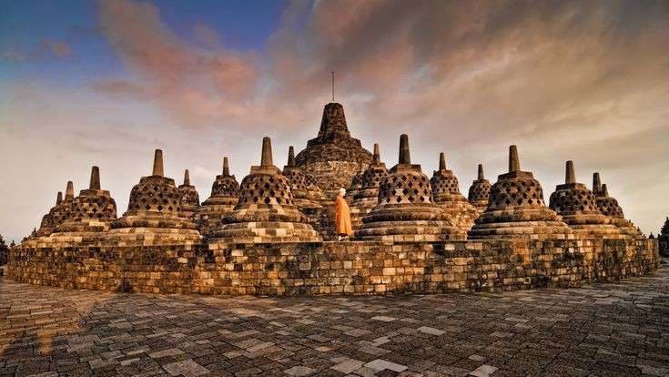
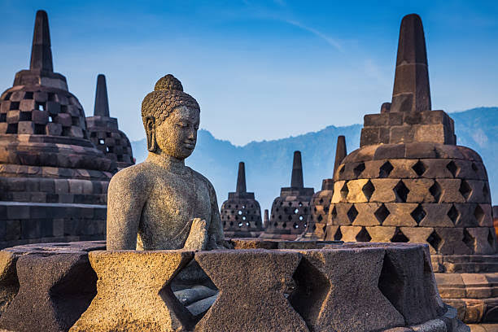

<!DOCTYPE html>
<html lang="en">
<head>
  <meta charset="UTF-8">
  <meta name="viewport" content="width=device-width, initial-scale=1.0">
  <meta http-equiv="X-UA-Compatible" content="ie=edge">
  <title>Candi Borobudur</title>
  
</head>
<body>
  <header>
    <h1>Candi Borobudur</h1>
    <nav>
        <ul>
          <li><a href="#explanation">Penjelasan Singkat</a></li>
          <li><a href="#architecture">Arsitektur Terkenal</a></li>
          <li><a href="#location">Lokasi</a></li>
          <li><a href="#dokumentasion">Foto/Video/Musik</a></li>
          <li><a href="#price">Harga Masuk</a></li>
        </ul>
    </nav>
  </header>
  
  <main class="container">
    
    <section id="explanation">
      <h2>Candi Borobudur</h2>
      
<b>Candi Borobudur</b> adalah bangunan peninggalan Buddha terbesar di dunia yang dibangun sekitar abad ke-8 hingga ke-9 pada masa dinasti <b>Syailendra</b>. Struktur ini berbentuk punden berundak dengan sembilan tingkat, enam berbentuk persegi dan tiga melingkar, yang melambangkan tahapan menuju pencerahan dalam ajaran Buddha.

      
Dindingnya dihiasi ribuan panel relief yang menceritakan kehidupan Buddha, ajaran moral, serta gambaran kehidupan masyarakat pada masa itu, sementara bagian atasnya dipenuhi stupa-stupa dengan satu stupa utama di puncak. Selain berfungsi sebagai tempat ibadah, Borobudur juga menjadi karya seni arsitektur dan simbol perkembangan kebudayaan serta spiritualitas yang sangat maju pada zamannya.

    </section>
    
    <section id="architecture">
      <h2>Arsitektur Terkenal</h2>
      
Ada banyak arsitektur yang terkenal di Candi Borobudur, diantaranya adalah sebagai berikut :

      <ul>
          <li>
            <strong>Stupa Induk</strong> - Stupa terbesar di puncak candi, jadi simbol utama pencerahan tertinggi dalam ajaran Buddha.
          </li>
          <li>
            <strong>Stupa Terawang</strong> – Deretan stupa berlubang di bagian atas, di dalamnya ada arca Buddha. Ini ciri khas yang paling mudah dikenali.
          </li>
          <li>
            <strong>Relief</strong> - Ukiran cerita di dinding candi yang menggambarkan kisah Buddha dan kehidupan zaman dulu.
          </li>
          <li>
            <strong>Arca Buddha</strong> - Patung-patung Buddha di relung dinding dan dalam stupa, dengan berbagai posisi tangan (mudra).
          </li>
          <li>
            <strong>Lorong/Galeri</strong> - Jalur mengelilingi candi yang dipakai untuk berjalan memutari bangunan saat ritual.
          </li>
      </ul>
    </section>
    
    <section id="location">
      <h2>Lokasi Candi Borobudur</h2>
      
Candi Borobudur terletak di Jawa Tengah, Indonesia, di sebuah kawasan dataran yang agak tinggi di dekat kota Magelang dan tidak jauh dari kota Yogyakarta.

      
      <iframe src="https://www.google.com/maps/embed?pb=!1m18!1m12!1m3!1d3953.513576082467!2d110.2016335147761!3d-7.607873694576365!2m3!1f0!2f0!3f0!3m2!1i1024!2i768!4f13.1!3m3!1m2!1s0x2e7a892b1f6d3f2b%3A0x86b0391d1e4c760!2sBorobudur%20Temple!5e0!3m2!1sen!2sid!4v161718192021!5m2!1sen!2sid" 
      width="100%" 
      height="450" 
      style="border:0;" 
      allowfullscreen="" 
      loading="lazy"></iframe>
    </section>
     
    <section id="dokumentasion" class="galerry">
       <h2>Foto - Video - Musik</h2>
       
Berikut beberapa hasil dokumentasi di situs wisata Candi Boro Budur

       <h3>Foto</h3>
         
         
       <h3>Video</h3>
       <video controls>
         <source src="video.mp4" type="video/mp4" alt="video.mp4">
       </video>
       <h3>Musik</h3>
       
Ini adalah musik yang cocok dengan suasana di Candi Borobudur

       <audio controls>
         <source src="Ndang - Backsound Musik Gamelan Bali.mp3" type="audio/mpeg" alt="audio.mp3">
       </audio>
    </section>
    
    <section id="price">
      <h2>Daftar Harga</h2>
      
Harga masuk ke wisata Candi Borobudur terbagi menjadi dua, yaitu hagra masuk ke pelataran dan naik candi (masuk ke bangunan).

      <h3>Harga Pelataran</h3>
      <table border="1">
        

        <thead>
          <tr>
            <th>Status Penduduk</th>
            <th>Usia</th>
            <th>Harga</th>
          </tr>
        </thead>
        
        <tbody>
          <tr>
            <td rowspan="2">WNI</td>
            <td>Anak-anak</td>
            <td>Rp 25.000</td>
          </tr>
          <tr>
            <td>Dewasa</td>
            <td>Rp 50.000</td>
          </tr>
          <tr>
            <td rowspan="2">WNA</td>
            <td>Anak-anak</td>
            <td>Rp 240.000</td>
          </tr>
          <tr>
            <td>Dewasa</td>
            <td>Rp 400.000</td>
          </tr>
        </tbody>
      </table>
      

      
      <h3>Harga Naik Candi</h3>
      
      

      <table border="1">
        <thead>
          <tr>
            <th>Status Penduduk</th>
            <th>Usia</th>
            <th>Harga</th>
          </tr>
        </thead>
        
        <tbody>
          <tr>
            <td rowspan="2">WNI</td>
            <td>Anak-anak</td>
            <td>Rp 75.000</td>
          </tr>
          <tr>
            <td>Dewasa</td>
            <td>Rp 120.000</td>
          </tr>
          <tr>
            <td rowspan="2">WNA</td>
            <td>Anak-anak</td>
            <td>Rp 305.000</td>
          </tr>
          <tr>
            <td>Dewasa</td>
            <td>Rp 455.000</td>
          </tr>
        </tbody>
      </table>
      

      
    </section>
    
  </main>
  <footer>
    
&copy; Dibuat oleh Rama Valdiansyah, X-PPLG 2

    
Hubungi saya di:<a href="mailto:ramavaldiansyah01@gmail.com" style="color: gold;">ramavaldiansyah01@gmail.com</a>

  </footer>

<!--
pertanyaan
1 Apa perbedaan fungsi antara tag 
 dan <section> dalam kasus yang Anda buat?
2 Mengapa penggunaan atribut alt pada tag  sangat penting dalam aspek aksesibilitas web?
3 Bagaimana peran tag <meta name="viewport"> dalam membuat halaman menjadi responsive?

jawaban
1 untuk membedakan 2 content yang sama
2 apabila image tidak muncul pada halaman web, yanv membaca dapat mengetahui bahwa dibagian tersebur terdapat image yang error
3 membuat ukuran website mengikuti ukuran layar sesuai dengan devace yang dipakai
-->

</body>
</html>
